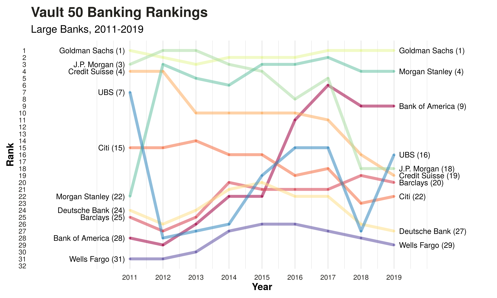

# Vault Banking 50

According to their website, [Vault.com](https://www.vault.com/) surveys thousands of professionals to rank the top employers and programs in various industries, such as law, consulting, and banking. The rankings are created using measures of prestige, culture, satisfaction, work/life balance, training, and compensation. This repo contains [data](https://github.com/erikgregorywebb/vault-banking-rankings/blob/master/data.csv) compiled for [Vault Banking 50](https://www.vault.com/best-companies-to-work-for/banking/best-banks-to-work-for-top-50/) from 2011 to 2019.

### Visual

The chart below plots the change in rank for ten of the largest banks over time. It was built in <code>R</code> using <code>ggplot</code>.

### Observations
- <b>Dominance of GS</b>: Over the nine year period, Goldman only dipped below #2 once, in 2012.
- <b>Decline of JPM</b>: Despite clenching #1 in 2012/2013, JPM declined in the following years, landing at #18.
- <b>Growth of BAML</b>: After landing #28 in 2011, BAML's rank has steadily improved over time, hovering at #9 in 2019. 

Obviously, rankings of this kind are highly subjective and subject to debate. The Vault rankings are interesting in that they attempt to collapse many different metrics of employee satisfaction into a single score. But really, how do you measure prestige?
